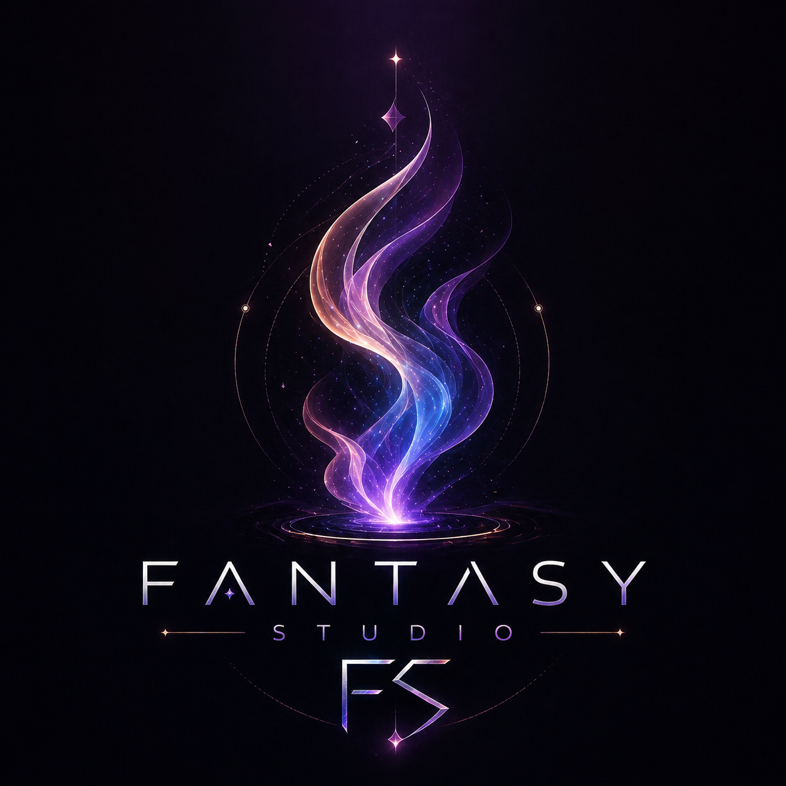
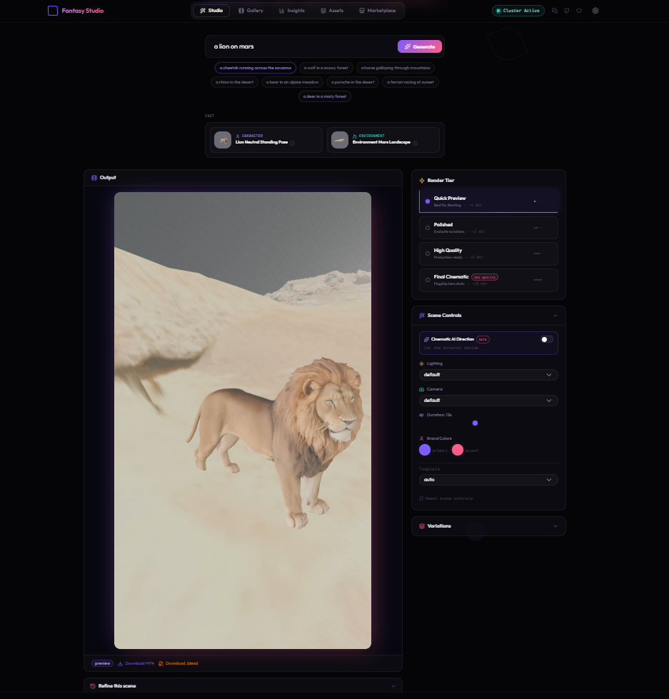
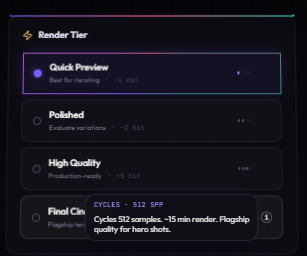
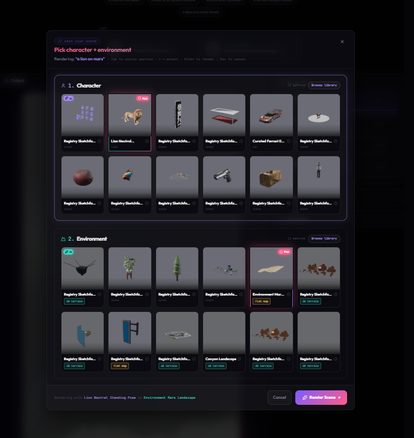
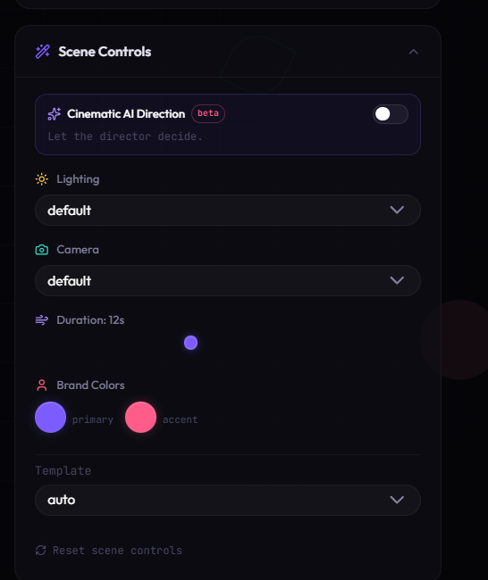
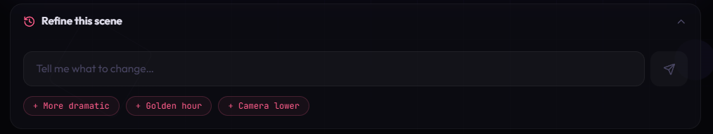
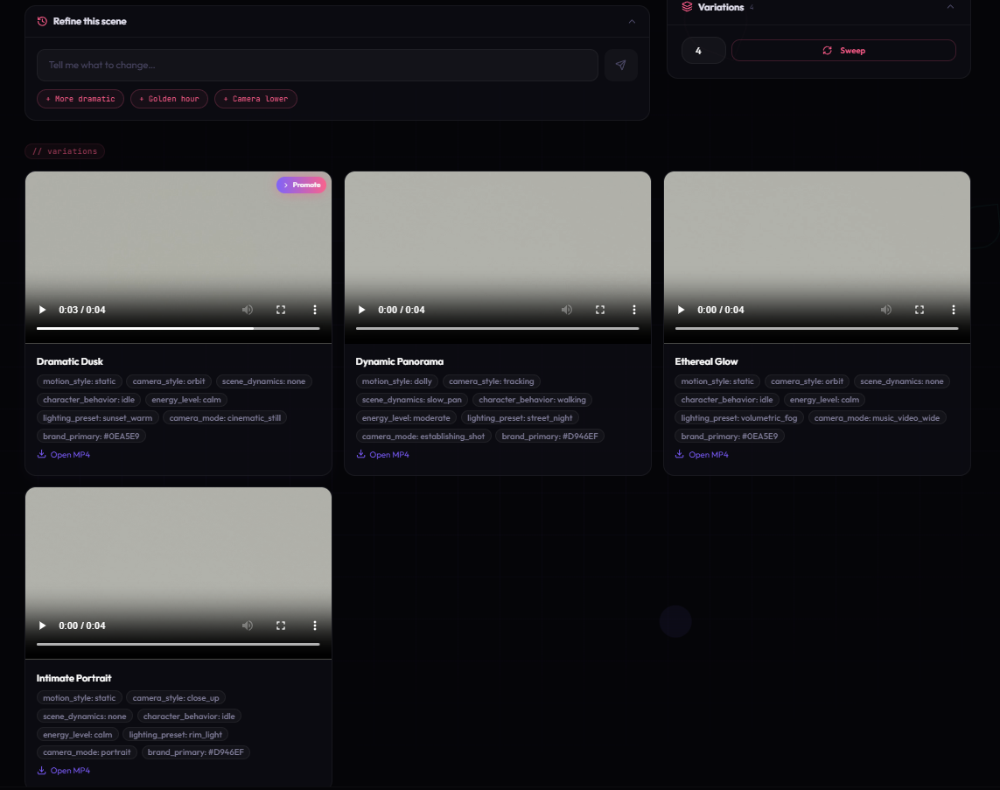
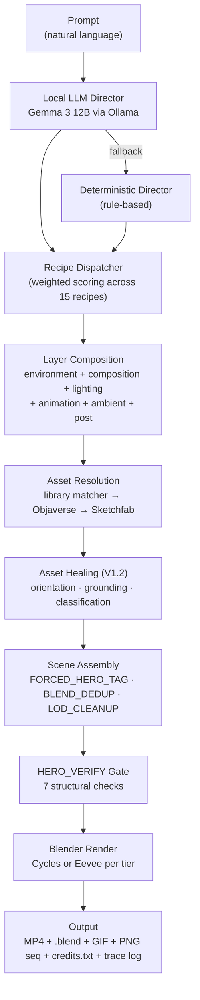

<div align="center">



# Fantasy Studio

### *What do you imagine?*

**Local AI that directs real 3D cinematic video. No diffusion models. You own every frame.**

[](LICENSE)
[](#)
[](#)
[](https://www.tiktok.com/@fantasylab.ai)
[](https://youtube.com/@Fantasy_lab_ai)
[](https://github.com/bgrut/fantasy-studio)

[Watch demo](https://youtube.com/@Fantasy_lab_ai) · [Try a render](INSTALL.md) · [Roadmap](ROADMAP.md) · [Discord (soon)](#) · [Waitlist](https://fantasylab.ai)

</div>

---

<div align="center">


*From prompt to cinematic 3D video in under 2 minutes. Rendered locally. No cloud. No subscription.*
</div>

---

> ## 🚧 Pre-launch / Early access — public source release Mid-May 2026
>
> Fantasy Studio is in private polish until launch. The repo is public so engineers can read the architecture and early adopters can join the waitlist. Installation works today; expect rough edges. Join the waitlist at **[fantasylab.ai](https://fantasylab.ai)** to get launch-day access and the first wave of curated assets.

---

## What is Fantasy Studio?

**Fantasy Studio is a desktop app that turns one-line prompts into directed 3D cinematic video using Blender, locally, on your hardware.** You type *"a polar bear walking through the arctic at sunset"* and 90 seconds later you have a 12-second MP4 — plus the underlying `.blend` file you can re-light, re-frame, and re-render in Blender forever.

No video diffusion anywhere in the pipeline — every frame is rendered, not hallucinated. A local LLM (Gemma 3 via Ollama) reads your prompt and **directs** the scene; local image-AI builds the cast: SDXL paints an identity-faithful reference of your subject, and **Microsoft TRELLIS.2** (MIT) turns it into a photoreal, textured 3D mesh — which gets auto-rigged, animated, lit, and rendered for real by Blender (Cycles or Eevee) on your GPU.

> **🚀 Engine V2 (current):** the full prompt → photoreal-3D → animated-MP4 pipeline, quality gates, A/B results, and licensing table are documented in **[docs/PIPELINE_V2.md](docs/PIPELINE_V2.md)**. The V1.x recipe/template system described below remains as the procedural fallback path.

This is a deliberate counter-bet to text-to-video diffusion. Where Sora-class tools generate pixels and ask you to accept whatever comes out, Fantasy Studio generates **a Blender scene** and gives you the directorial controls to refine it. Your output is deterministic, editable, ownable, and — because nothing leaves your machine — cost-zero per render after install.

## Why this exists

In late 2025 OpenAI quietly killed Sora's consumer offering. The reason wasn't a moral failing or a lawsuit — it was math. Diffusion video at usable quality costs $0.50–$2.00 per render and produces output the user can't actually direct. You can re-roll the dice; you can't re-frame the shot. For real creative work, that's the wrong tool.

Fantasy Studio takes the opposite bet: **AI directs real tools, it doesn't replace them.** The model is the cinematographer and casting director; Blender is still the camera and the render farm. Cost per render is electricity. Output quality is bounded by Blender, not by training data. Iteration is parametric — change the lighting preset, hit render, get the same scene with new mood.

## Who this is for

- **Indie filmmakers** prototyping cinematic shots before live-action prep
- **Marketers** making product hero videos and social cuts without a 3D team
- **YouTubers** needing scene-specific B-roll that exact stock footage can't supply
- **Game developers** producing cinematic trailers and pitch reels in hours, not weeks
- **Creators on TikTok/Shorts** generating vertical 3D content at the cadence the algorithm rewards
- **Storyboard artists** turning written beats into moving previs
- **Anyone who wants to make 3D video** without first learning Blender

## Key features

- 🎬 **AI cinematographer** — Local Gemma 3 12B picks recipe, cast, camera, lighting from your prompt, with a deterministic fallback when the LLM is unavailable
- 🎨 **15 cinematic recipes** at launch (`vehicle_desert_hero`, `hero_ocean_horizon`, `cat_canyon_cinematic`, `animal_forest_intimate`, …) plus a layered template system that composes environment / composition / lighting / animation / ambient / post into one render
- 📚 **316-asset curated library** spanning 94 characters, 61 environments, 38 vehicles, 37 props, plus auto-fetch fallback to Objaverse and Sketchfab when the library doesn't have what you asked for
- 🌅 **Procedural HDRI + recipe-driven lighting** — golden hour, sunset landscape, night automotive, cinematic 3-point, all dispatched per recipe
- 🎯 **Four render tiers** — Quick Preview (Eevee, ~30s), Polished (Eevee+effects, ~1m), High Quality (Cycles, ~3m), Final Cinematic (Cycles full, ~10m)
- 📦 **Real exports** — MP4 video, animated GIF, PNG sequence, **and the `.blend` source file** so the scene is yours to re-edit forever
- 🛡️ **HERO_VERIFY render gate** — every render passes seven structural checks (bbox sanity, frustum, framing, primitive detection, orientation, grounding) before frames hit disk
- 🔧 **Non-destructive asset healing** — orientation, ground offset, shape classification computed once on ingest and stored as metadata; original `.glb` / `.blend` files never touched
- 🕹️ **NEW: Playable game export (Phase 26)** — the same prompt that makes a video can make a *game*: `python scripts/export_game.py --prompt "a lone wanderer in a misty forest at night, collect 7 fireflies"` emits a self-contained three.js web build (WASD/gamepad/touch, real mocap walk/run, physics, NPCs that wander or follow, collectible objectives with a win screen). Runs offline in any browser — vendored three.js (MIT) + Rapier physics (Apache-2.0), zero CDN. A Godot 4 project export (`--godot`, MIT engine) ships beside it
- 🖥️ **NEW: Studio modes + desktop app (Phase 30)** — a 🎬 Video / 🕹️ Game chooser right in the Studio: game mode extracts your idea via local Ollama, builds the game in ~30-60s **with no GPU**, and embeds it playable in the app (Rebuild / Fullscreen). Ships as a native desktop window via Tauri 2 (`desktop/launch.ps1`)
- 🌐 **100% local execution** — no API keys, no cloud, no per-render fee, no rate limits, no creative work leaving your machine
- 📜 **Full pipeline trace logging** — every render writes a `pipeline_trace.log` next to the video so you can debug exactly what the AI directed and why

## Get started

```powershell
git clone https://github.com/bgrut/fantasy-studio && cd fantasy-studio
.\setup.ps1                 # one-command install (Python venv + npm + env files)
.\desktop\launch.ps1        # opens the native Fantasy Studio desktop app
```

Full prerequisites and troubleshooting: **[INSTALL.md](INSTALL.md)**. Key facts:
- 🕹️ **Game mode needs no GPU** — build and play from prompts on any laptop
- 🎬 Video mode wants an NVIDIA GPU (8 GB+) for Cycles renders and new-asset generation
- Every game build is a **different level** (world seed shown in-app; "New level" rerolls, reuse a seed to reproduce a favorite)

## Ship the games you make

Each build is a **self-contained folder** (vendored MIT/Apache libs, zero CDN):
zip `dist/` for itch.io or any static host, or add `--godot` for a **Godot 4
project** you can open in the free editor and export to Windows/macOS/Linux/mobile —
no royalties. Details: [INSTALL.md → Deploying](INSTALL.md#deploying-the-games-you-make).

## See it in action

<div align="center">

|  |  |
|---|---|
| <br/>*"a polar bear in the arctic at sunset"* — `hero_ocean_horizon` | <br/>*"a ferrari racing at sunset"* — `vehicle_desert_hero` |
| <br/>*"a horse galloping through the mountains"* — `animal_mountain_walk` | <br/>*"a rhinoceros in the desert"* — `hero_desert_epic` |

</div>

---

## Inside the app

A guided tour of the studio. Type a prompt, AI directs, Blender renders — all local, all yours.

### The studio



The main canvas. Type any scene you can imagine. The director plans casting, lighting, and camera. Blender renders locally on your machine. The `.blend` export is yours forever.

### Pick your render quality



Four tiers, from Quick Preview (~30 s, Eevee) to Final Cinematic (production-ready, 512-sample Cycles). Iterate fast, then commit to a hero render when you're ready.

### Cast your scene



The director auto-picks a hero and environment that match your prompt. Don't like the choice? Browse the full library and pick your own. Every asset is orientation-corrected and ground-aligned through the V1.2 healing pipeline.

### Direct every detail



Override the AI's choices when you want fine control. Lighting presets, camera modes, duration, brand color, template selection — every control flows directly into the render manifest.

### Refine with words



After the first render, refine in natural language. *"Make it more dramatic."* *"Lower the camera."* *"Switch to golden hour."* The director iterates on the existing scene without starting over.

### Generate variations



Render multiple variations of a scene with one click. Pick the one that lands and promote it to your main render. Useful for hero shots where you want options.

For the full walkthrough — prompt patterns, tier guidance, Blender export workflow — see **[docs/USER_GUIDE.md](docs/USER_GUIDE.md)**.

---

## What works well right now (constraint-sprint honesty)

Fantasy Studio is **best at single-subject cinematic shots** — one animal, one vehicle, or one character placed in an environment, performing a simple action (running, standing, flying, racing).

Multi-subject composition — a character holding a prop, two characters interacting, named-IP characters like Mickey or Elmo — is intentionally **not in V1**. We chose to ship a tool that does one thing exceptionally rather than many things poorly. V2 work on multi-subject scene composition with action verbs is on the [roadmap](ROADMAP.md).

This isn't a limitation we're hiding — it's a positioning we're making explicit. Single-subject cinematic shots are 80% of what indie creators, marketers, and YouTubers need, and Fantasy Studio is engineered to make them feel inevitable.

---

## How it works



### Local LLM director (with deterministic fallback)

Fantasy Studio runs **Google Gemma 3 12B** locally via [Ollama](https://ollama.com). The director prompt is structured: scene family, subject, environment, mood, energy, weather. The LLM emits a strict JSON manifest. When the LLM is unreachable or returns malformed JSON, a deterministic rule-based director takes over so renders never block on inference. Both paths produce the same manifest schema downstream, so the rest of the pipeline doesn't know or care which director ran.

### V1.2 asset healing pipeline

Most online 3D models are broken in predictable ways: rotated 90° wrong, origin floating mid-air, no shape classification, wrong scale band. Traditional pipelines either reject these assets or render them broken. Fantasy Studio's V1.2 healer **runs once on ingest** and stores its corrections as metadata in `library.json`:

- `orientation_fix_rotation_euler` — 3-axis correction in radians, applied at import
- `ground_offset_z` — vertical correction so the asset sits on z=0 ground
- `shape_class` — `character_upright` / `vehicle_generic` / `3d_terrain` / `flat_map` etc., used by the lighting and camera systems
- `provisional_ready` — boolean gate, blocks half-fixed assets from auto-pick

The originals are never modified. Re-running the healer is idempotent. Healing is what lets a curated 316-asset library punch above its weight: each entry is render-ready by the time it reaches the matcher.

### V1.3 recipe / template / layer system

Fantasy Studio's renderer is **renderer-agnostic by design**. Recipes are JSON, not Python:

```text
app/templates_v2/recipes/         15 recipes (vehicle_desert_hero, hero_ocean_horizon, ...)
app/templates_v2/base/            render-tier presets (preview / polished / hq / cinematic)
app/templates_v2/environments/    terrain blends, ocean, city, forest, ...
app/templates_v2/compositions/    low_orbit, push_in, tracking_low, wide_establishing
app/templates_v2/lighting/        sunset_landscape, golden_hour_warm, automotive_night
app/templates_v2/animations/      vehicle_drive, hero_idle_subtle, animal_walk
app/templates_v2/ambient/         dust_motes, ocean_spray, forest_particles
app/templates_v2/post/            cinematic_graded, vintage_film, clean_commercial
```

A weighted dispatcher reads the prompt + scene plan and scores all 15 recipes; the highest scorer drives the render. Each recipe pulls its layers by name, layers compose into a final scene config, and the executor walks the config and emits Blender ops. Adding a new recipe is editing a JSON file — no Python.

### Forced-hero / forced-environment tagging

When the user manually picks a hero from the library browser, the manifest gets a `forced_hero_id`. The asset agent respects it and skips its prop / curated injectors. At render time the `[FORCED_HERO_TAG]` pre-pass walks descendants of every `is_hero_root` and stamps `is_forced_hero=True` on mesh descendants within 10m of origin. Downstream cleanup, framing, and verification only touch the forced-hero set — env-placed siblings are immune.

### HERO_VERIFY render gate

Before any frame is rendered, every scene passes seven structural checks:

1. **`has_hero_tag`** — at least one mesh is tagged
2. **`bbox_sane`** — hero diagonal in [0.2m, 50m] (V1.4.1 floor)
3. **`in_frustum`** — hero is inside the camera's view frustum at frame_start
4. **`fill_ok`** — hero fills 35–70% of the frame
5. **`not_primitive`** — hero has > 100 polys (rejects placeholder cubes)
6. **`oriented_correctly`** — vehicles aren't on their nose; characters aren't on their side
7. **`grounded`** — hero bottom is within 0.5m of nearest env top (warn-only)

A `bbox_sane` or `oriented_correctly` failure aborts the render with a structured `[HERO_VERIFY] ABORT` line that the API formatter surfaces as a user-facing error. We'd rather fail loudly than render something broken.

### V1.4.1.1 LOD twin detection

Some `.blend` files (notably the BMW M4 we curated early on) ship with two complete copies of the hero geometry under sibling `Sketchfab_model` parents — an artifact of how the source was exported. Our V1.3.5 transactional dedup correctly merges the parent EMPTYs, but the matrix-restore step preserved the loser sub-tree's *world* transforms, leaving identical mesh twins at 4× scale alongside the LAYOUT-scaled keeper set. Result: dual-car render.

The `[LOD_CLEANUP]` pass builds a signature index `(vert_count, face_count, rounded_world_dims_xyz)` from the `is_forced_hero` set, walks the untagged `is_hero` siblings, and `hide_render`s any with an exact signature match. False-positive rate is structurally zero — the twin must already exist in the forced set. Originals are preserved (`hide_render`, not deleted) for debugging.

### Matcher confidence + alias map (V1.3.7)

The library matcher normalizes both the prompt's subject and each asset's `subject` field through a 45-entry alias map (plurals → singular, `car` → `vehicle`, `animal` → `character`) and a stopword filter, then scores each candidate: 1.0 for exact subject match, 0.85 for exact tag, 0.40–0.75 for partial subject substring, 0.30–0.60 for partial tag. Threshold is 0.30. Exact matches short-circuit the diversity rotation so an *elephant* prompt never returns a *rhinoceros* (which it did, briefly, in V1.3.6 — bug fixed).

Every pick logs `[MATCHER] picked=… (score=…, exact_subject) runner_up=… (score=…)` so bad picks are debuggable.

### Pipeline trace logging

Every render writes a `pipeline_trace.log` next to the output file. It contains every `[STAGE]` marker (MAIN_START → SCENE_CONFIGURED → TEMPLATE_DISPATCH → ENV_LAYERS → FORCED_HERO_TAG → LOD_CLEANUP → HERO_VERIFY → RENDER_START → RENDER_COMPLETE), every `[CATEGORY]` log line, and the full manifest the LLM produced. When something goes wrong, a single grep tells you which stage and why.

### Renderer-agnostic templates

Layers and recipes don't import `bpy`. The executor does. That separation is deliberate: the V2 roadmap includes Unreal Engine and (eventually) Godot backends, where the same recipe JSON drives a different executor. The whole template system is a thin layer above the renderer; the LLM director doesn't know or care which one is on the other end.

### Four-tier render system

| Tier | Engine | Samples | Resolution | Approx. time | Use case |
|---|---|---|---|---|---|
| Quick Preview | Eevee | 16 | 720×1280 | ~30s | Iterating on prompt / cast |
| Polished | Eevee + effects | 32 | 1080p | ~60s | Sharing / social posting |
| High Quality | Cycles | 128 | 1080p | ~3m | YouTube / portfolio |
| Final Cinematic | Cycles | 512+ | 4K | ~10m+ | Hero shot for a paid project |

The tier choice is a render-time decision; the same scene file produces all four.

---

## Quick start

Full guide: **[INSTALL.md](INSTALL.md)**. The 5-step happy path:

```powershell
# 1. Clone
git clone https://github.com/bgrut/fantasy-studio
cd fantasy-studio

# 2. Install prereqs: Blender 5.1+, Ollama, Python 3.11+, Node 20+
#    See INSTALL.md for download links and one-time PowerShell ExecutionPolicy fix

# 3. One-command setup (creates venv, installs all deps, scaffolds .env files)
.\setup.ps1

# 4. Pull the LLM model (~7 GB, first-time only)
ollama pull gemma3:12b

# 5. Launch
.\launch.ps1
# Opens backend (:8789) + frontend (:3000) in two windows.
# Open http://localhost:3000 in your browser.
```

## First render walkthrough

1. **Type a prompt** — *"a polar bear in the arctic at sunset"*
2. **Cast appears** — auto-picked hero + environment, with a cast panel for manual override
3. **Click Generate** — render starts; pipeline log streams in real time
4. **~90 seconds later** — MP4 plays in the preview pane, `.blend` ready to download

Full guide: **[docs/USER_GUIDE.md](docs/USER_GUIDE.md)**.

---

## How Fantasy Studio compares

| | Fantasy Studio | Sora | Runway Gen-3 | Pika 2 | Spline AI |
|---|---|---|---|---|---|
| Rendering tech | Real Blender (Cycles/Eevee) | Diffusion | Diffusion | Diffusion | 3D editor + AI fill |
| Runs locally | ✅ Yes | ❌ Cloud | ❌ Cloud | ❌ Cloud | ⚠️ Hybrid |
| Deterministic output | ✅ Same prompt → same scene | ❌ Random | ❌ Random | ❌ Random | ⚠️ Partly |
| Re-render with new lighting | ✅ Same scene, swap preset | ❌ New roll | ❌ New roll | ❌ New roll | ⚠️ Manual |
| Export to Blender | ✅ `.blend` included | ❌ MP4 only | ❌ MP4 only | ❌ MP4 only | ❌ |
| You own the output | ✅ Forever, any use | ⚠️ Per ToS | ⚠️ Per ToS | ⚠️ Per ToS | ✅ |
| Usage limits | None (your hardware) | Credits | Credits | Credits | Free tier |
| Monthly cost | $0 (after install) | Discontinued | $15–$95/mo | $10–$70/mo | $0–$25/mo |
| Commercial use | ✅ With attribution (BSL) | ⚠️ Plan-dependent | ⚠️ Plan-dependent | ⚠️ Plan-dependent | ⚠️ Plan-dependent |

---

## Roadmap

**Shipped** — V1.4.1.1: dual-car LOD twin fix, scale floor at 20%, library refresh, V1.3.7 matcher tuning, V1.3.6 polish (orb cleanup, BMW orientation, env preset guards), V1.3.5 transactional dedup, V1.3.4 forced_hero descendant tagging, V1.3 template/layer system, V1.2 healer.

**In Progress** — V1.4.2: empty-state showcase carousel, scene complexity guardrail. V1.4.3: cast panel viewport sizing, .blend surfaced in output panel.

**Future** — Hero animation library (pre-baked walk/run/fly cycles), expanded camera language vocabulary, cloud render tier, voice prompt input, marketplace (V2), multi-subject composition (V2), Unreal Engine backend (V2+).

Full roadmap: **[ROADMAP.md](ROADMAP.md)** · Full version history: **[CHANGELOG.md](CHANGELOG.md)**.

---

## Built in public

- **TikTok**: [@Fantasylab.ai](https://www.tiktok.com/@fantasylab.ai)
- **YouTube**: [@Fantasy_lab_ai](https://youtube.com/@Fantasy_lab_ai)
- **Discord**: Coming soon
- **Patreon**: Coming soon
- **Waitlist**: [fantasylab.ai](https://fantasylab.ai)

Watch the build, send a prompt, get a render in your feed. We post weekly progress through launch.

---

## Contributing

Solo dev right now. Bug reports, feature requests aligned to the roadmap, recipe contributions, and platform-support PRs (macOS / Linux) all genuinely welcome. Full guide: **[CONTRIBUTING.md](CONTRIBUTING.md)**.

---

## FAQ

**Is it really free?** Yes — for personal and non-commercial use, forever, under BSL 1.1. After 4 years it auto-converts to Apache 2.0.

**Do I need to know Blender?** No. You can use Fantasy Studio without ever opening Blender. If you *do* know Blender, the `.blend` export gives you the whole scene to re-edit.

**Does it need a GPU?** Strongly recommended. Cycles renders are GPU-accelerated; Eevee runs on integrated graphics but slowly. Minimum: any RTX 20-series or equivalent. Recommended: RTX 3060+ with 8 GB VRAM.

**How does this compare to Runway / Sora / Pika?** Different bet. They generate pixels with diffusion (random, uncontrollable, expensive per render). Fantasy Studio directs Blender (deterministic, editable, electricity-only after install). See the comparison table above.

**What's the catch?** It's slower than diffusion (90s vs 10s per clip). The library is curated, not infinite — for fully custom characters you'll need to add assets manually. Multi-subject scenes are V2.

**Can I sell videos I make?** Yes. The license restricts re-selling Fantasy Studio itself (or hosting it as a paid service); your *output* is yours. Asset-level attribution may apply to specific Sketchfab/Poly Haven sources — see the auto-generated `credits.txt` next to each render.

**What about complex prompts (multi-subject)?** V1 is single-subject by design. Multi-subject scene composition is the headline V2 feature. See [docs/PROMPTING.md](docs/PROMPTING.md) for the supported pattern.

**What's the license really?** BSL 1.1 — free for non-commercial use, source visible, attribution required, auto-converts to Apache 2.0 in 4 years. Commercial licensing available from FantasyLab AI. Full text in [LICENSE](LICENSE).

**When is launch?** Mid-May 2026. Pre-launch source release is live now for engineers, contributors, and waitlist signups. Public announcement campaign at launch.

**Why 'Fantasy Studio' and 'FantasyLab AI'?** Fantasy Studio is the product. FantasyLab AI is the company shipping it. Same team, same author.

---

## License

**Business Source License 1.1** — free for personal and non-commercial use, source visible, attribution required, auto-converts to Apache 2.0 four years after first commit. Full terms in **[LICENSE](LICENSE)**.

## Acknowledgments

Fantasy Studio stands on a giant pile of generous open work. Direct gratitude to:

- [**Blender**](https://blender.org) — the renderer, the API, the foundation
- [**Ollama**](https://ollama.com) — local LLM runtime that makes the director path possible
- [**Google Gemma**](https://ai.google.dev/gemma) — the open-weight model the director uses
- [**Objaverse**](https://objaverse.allenai.org) — fallback hero asset source
- [**Poly Haven**](https://polyhaven.com) — environment HDRIs and curated terrain
- [**Sketchfab**](https://sketchfab.com) — curated hero and prop assets
- The broader open-source 3D + AI community

---

<div align="center">

⭐ **If this looks interesting, star the repo so launch shows up in your GitHub feed.**

Built by **Brandon Grutkowski** · [FantasyLab AI](https://fantasylab.ai) · 2026

[TikTok](https://www.tiktok.com/@fantasylab.ai) · [YouTube](https://youtube.com/@Fantasy_lab_ai) · [Waitlist](https://fantasylab.ai)

</div>
