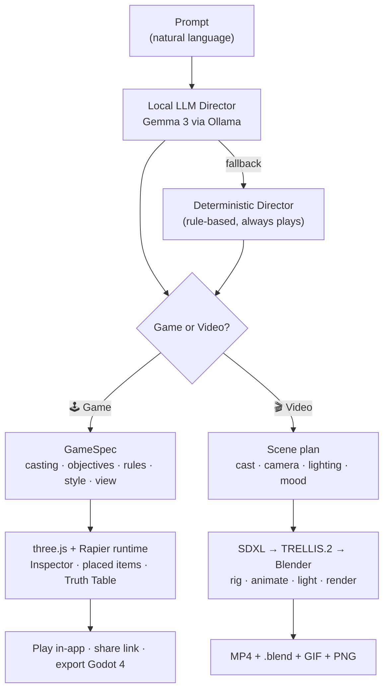

<div align="center">


# Fantasy Studio

### *What do you imagine?*

**Type a sentence. Get a playable 3D game or a cinematic video — no code, running entirely on your own machine. Then reshape it in real time by pointing at the world.**

### ⬇️ Get it — one command, installs everything

</div>

```powershell
irm https://raw.githubusercontent.com/bgrut/fantasy-studio/main/bootstrap.ps1 | iex
```

<div align="center">

*Then `.\desktop\launch.ps1` opens the app. 🕹️ **Game mode needs no GPU** · prereqs auto-checked ([details](INSTALL.md))*

<br/>

[](LICENSE)
[](#)
[](https://www.tiktok.com/@fantasylab.ai)
[](https://youtube.com/@Fantasy_lab_ai)
[](https://github.com/bgrut/fantasy-studio)

[Watch demo](https://youtube.com/@Fantasy_lab_ai) · [Install](INSTALL.md) · [Roadmap](ROADMAP.md) · [Waitlist](https://fantasylab.ai)

</div>

---

<div align="center">


*One sentence → a playable game or a cinematic video, in minutes. Rendered locally. No cloud. No subscription. No code.*
</div>

---

## What is Fantasy Studio?

**Fantasy Studio is a local-first desktop app that turns a plain-language sentence into two things: a playable 3D game, or a directed cinematic video — with no coding, no cloud, and no per-render fee.** Everything runs on your own hardware.

- 🕹️ **Game mode** — *"a fox with 9 lives on a dangerous mountain trek: collect 6 food, avoid the hostile wolves, then reach the shelter"* → a playable third-person game in about a minute, **with no GPU**. Then **Inspect** the running game: hover to identify anything, click a spot, and type — *"place a campfire here," "place a sign that says stay near the fire," "fence off this pass."* It generates and drops it in seconds, and the rules are real (a sign that says the wolves fear the light means they actually won't enter the glow).
- 🎬 **Video mode** — *"a polar bear walking through the arctic at sunset"* → a cinematic MP4 in ~90 seconds, plus the underlying `.blend` file you can re-light and re-render in Blender forever. Every frame is **rendered, not hallucinated** — no video diffusion anywhere in the pipeline.

Both modes share the same brain: a **local LLM** (Gemma 3 via Ollama) reads your prompt and directs the scene, and local image-AI (SDXL → Microsoft TRELLIS.2, MIT) builds the cast — an identity-faithful 3D character generated once and cached in your library forever. No API keys. No accounts. No telemetry. Nothing you make leaves your machine unless you choose to publish it.

> The bet: **AI directs real tools instead of replacing them.** Where diffusion tools generate pixels and ask you to accept whatever comes out, Fantasy Studio generates *a game you can edit* and *a Blender scene you can re-render* — deterministic, editable, and yours to own.

---

## 🕹️ The game engine — build a game by describing it, then edit it live

This is what makes Fantasy Studio different from every other "AI game" tool: **you don't just generate a game, you keep shaping it — visually, in real time, with no code.**

- **One sentence → a playable game.** Third-person controls (WASD / gamepad / touch), real motion-capture walk/run, physics, an objective grammar you can freely combine: **collect · defeat · reach · survive · race**, health & lives, win/lose, and a narrative intro.
- **Inspect mode — point at the world and change it.** Hover any object and a live chip identifies it (`wolf · hostile · speed 3`). Click a spot to select it, then type a plain-language edit. Two placement tools: **📍 Point** (one spot) and **📏 Line** (drag a run — a fence tiles between two clicks). Placed items include instant procedural props (book, sign, chest, building, rock, beacon, campfire, fence) or any noun from your library.
- **Rules that are actually honored.** Toggle rule chips on any placed object — 🔥 safe zone (hostiles fear it), 🚧 blocks enemies, ⚡ hurts on touch — and the runtime enforces them. Books and signs are **readable** (walk up, press E). A campfire is a real safe zone, not decoration.
- **📜 The Truth Table.** One panel lists every rule your game actually enforces — hero stats, mission steps, enemy behavior, placed-item rules, rewards — derived from the live spec. Your game's contract, on screen.
- **Style presets you pick, never guessed.** 🎬 Photoreal · 🖍️ Cartoon (cel + ink outlines) · 🌸 Anime · 🕯️ Horror · 👾 Pixel · 📐 Low-poly. One global look applied coherently to the whole world.
- **View presets.** 🧊 3D third-person · 🗺️ Top-down 2D (Zelda-style) · 🎞️ Side-scroller. Same world, a different genre from one chip.
- **Walk-in destinations.** "Reach the shelter / cabin / lighthouse / castle" builds a real structure — open door, warm windows, a lit hearth — that you win by stepping inside.
- **Levels & projects.** Stack levels into one game via clickable level tiles (click to play, inspect, and edit any level, then save it back), and export the whole thing as a hub-menu game.

<div align="center">
<br/>
<sub>Prompt → playable world → click-to-place a campfire and a readable sign → the wolves keep their distance from the firelight.</sub>
</div>

---

## 🌐 Share it — a link anyone can play

Every game you build is a **self-contained web build** (vendored three.js MIT + Rapier Apache-2.0, zero CDN, runs offline). Three ways to ship:

- **Community Marketplace (in-app).** Publish a full game or a generated character to your own free Cloudflare worker and it lands on a public feed — anyone gets a link they can open in Chrome, Firefox, or on their phone and play instantly. Browse the community, and install others' characters straight into your library to cast in your own prompts. Local-first: nothing uploads until you press Publish, and shared work is CC-BY-4.0. ([privacy & sharing policy](PRIVACY.md))
- **Zip it.** Drop the `dist/` folder on itch.io or any static host.
- **Export to Godot 4** (free, MIT). Get a real Godot project — press F5 and it plays, with your missions, rules, placed items, readable signs, styles and views carried over. From there you own it completely and can take it toward a Steam release. Every export ships a `STEAM_GUIDE.md` walking the path.

---

## 🎬 The video engine — direct a cinematic shot, own every frame

The same prompt that makes a game can make a film. Video mode renders **real Blender frames** — no diffusion, no random re-rolls.

- **AI cinematographer** — the local LLM picks cast, camera, lighting, and mood from your prompt; a deterministic fallback keeps renders working if the LLM is unavailable.
- **Real 3D characters** — SDXL paints an identity-faithful reference, TRELLIS.2 turns it into a textured mesh, and Blender auto-rigs, animates (real CMU motion capture), lights, and renders it.
- **Story Director** — one prompt → a multi-scene film, with scenes assembled into a single MP4. Edit any scene later ("make it a snowy night") and re-render just that scene.
- **Render tiers** — Quick Preview (Eevee, ~30s) → Final Cinematic (Cycles, 4K). The same scene produces all four.
- **Real exports** — MP4, GIF, PNG sequence, **and the `.blend` source file**, so the scene is yours to re-edit forever.

<div align="center">

|  |  |
|---|---|
| <br/>*"a ferrari racing at sunset"* | <br/>*"a horse galloping through the mountains"* |

</div>

---

## Who this is for

- **Anyone with a game or video idea and no engine skills** — describe it, play it, tweak it, ship a link.
- **Indie devs & hobbyists** — prototype a playable level in a minute, then graduate it to Godot for a real build.
- **Filmmakers, marketers & YouTubers** — cinematic B-roll and hero shots without a 3D team, editable forever.
- **Creators on TikTok/Shorts** — vertical 3D content at the cadence the algorithm rewards.
- **Educators & tinkerers** — a no-code sandbox where "what if I add a rule here?" is one click away.

---

## Get started

```powershell
# One command — installs everything (Blender, Ollama, Python venv, npm, env files)
irm https://raw.githubusercontent.com/bgrut/fantasy-studio/main/bootstrap.ps1 | iex

.\desktop\launch.ps1        # opens the native Fantasy Studio desktop app
```

Full prerequisites and troubleshooting: **[INSTALL.md](INSTALL.md)**. Key facts:

- 🕹️ **Game mode needs no GPU** — build and play from prompts on any laptop.
- 🎬 **Video mode** wants an NVIDIA GPU (8 GB+) for Cycles renders and first-time character generation. (Characters are generated once, then cached and reused instantly forever — including across game levels, so the same fox stays the same fox.)
- Every fresh game build is a **new world** (seed shown in-app; reuse a seed to reproduce a favorite).

---

## How it works



**Local, deterministic, ownable.** The LLM is the director; three.js and Blender are the engines. Same prompt → same world (games are seeded; videos are real scene files). Cost per render is electricity. Characters you generate are cached in a local library and reused instantly — the 30-minute image-to-3D generation only ever happens the first time a brand-new noun appears.

Deep dives: **[docs/PIPELINE_V2.md](docs/PIPELINE_V2.md)** (video pipeline) · **[docs/USER_GUIDE.md](docs/USER_GUIDE.md)** (full walkthrough) · **[CHANGELOG.md](CHANGELOG.md)** (everything that shipped).

---

## How Fantasy Studio compares

| | Fantasy Studio | Diffusion video (Sora/Runway/Pika) | AI game tools (cloud) |
|---|---|---|---|
| Makes games | ✅ Playable, editable in real time | ❌ | ✅ (varies) |
| Makes videos | ✅ Real Blender, `.blend` included | ✅ Pixels only | ❌ |
| Runs locally | ✅ Fully | ❌ Cloud | ⚠️ Mostly cloud |
| Edit after generating | ✅ Point at the world, type | ❌ New roll | ⚠️ Limited |
| Deterministic | ✅ Same prompt → same world | ❌ Random | ⚠️ Partly |
| You own the output | ✅ Forever | ⚠️ Per ToS | ⚠️ Per ToS |
| Export to a real engine | ✅ Godot 4 project | ❌ | ⚠️ Varies |
| Monthly cost | $0 after install | $10–$95/mo | Credits/subscription |

---

## Honest state of things (constraint-sprint transparency)

Fantasy Studio is built and used solo, currently **without a working GPU on the dev machine** — so the honest edges are:

- **Character textures** are side-projection baked, so off-axis fur reads a little soft (a warm-fill pass smooths the worst of it); true multi-view texturing is the top GPU-day upgrade.
- **Motion** can warp slightly on some rigs.
- **Video mode** is best at single-subject cinematic shots today; multi-subject composition is on the roadmap.

None of this is hidden — it's shown warts-and-all. The game side (Inspector, rules, styles, views, sharing, Godot export) is the most complete and is what's front-and-center above. Full detail and the GPU-day list live in **[ROADMAP.md](ROADMAP.md)** and **[CHANGELOG.md](CHANGELOG.md)**.

---

## Project status

**Public early access — active daily development.** The app installs and works today (games, videos, editing, sharing, Godot export are all live). Expect rough edges and rapid iteration. Star the repo to follow along, and join the waitlist at **[fantasylab.ai](https://fantasylab.ai)** for launch-day access and curated assets.

---

## FAQ

**Do I need to know how to code?** No. You describe games and videos in plain English and edit them by pointing and typing. If you *do* code, the game exports as a Godot project and videos export as `.blend` files — both fully yours to extend.

**Do I need a GPU?** Game mode: no — it builds and plays on any laptop. Video mode and first-time character generation: an NVIDIA GPU (8 GB+) is strongly recommended (once generated, characters are cached and reused with no GPU).

**Do I have to generate a new character every time?** No. Each character (a cat, a wolf, a dragon…) is generated once and cached in your library forever, then cast instantly in any future prompt or game — including across all the levels of a game.

**Can I share the games I make?** Yes — publish to the in-app Community Marketplace for a public browser link (anyone can play, no install), zip the build for itch.io, or export a Godot project. Shared community content is CC-BY-4.0.

**Is it really free / local?** Yes. Free for personal and non-commercial use under BSL 1.1 (auto-converts to Apache 2.0 after 4 years). Runs entirely on your machine — no API keys, no cloud, no telemetry, no per-render fee.

**How is this different from Sora / Runway / a cloud game maker?** Different bet: those generate pixels or run in the cloud and hand you something you can't really direct. Fantasy Studio generates *a game you keep editing* and *a Blender scene you keep rendering*, locally, deterministically, and you own the output. See the comparison table above.

**When is launch?** Public early access is live now for creators, engineers, and waitlist signups; a full public launch campaign follows. There's no gate on trying it today.

---

## License

**Business Source License 1.1** — free for personal and non-commercial use, source visible, attribution required, auto-converts to Apache 2.0 four years after first commit. Commercial licensing available from FantasyLab AI. Full terms in **[LICENSE](LICENSE)**.

## Acknowledgments

Fantasy Studio stands on a giant pile of generous open work:

- [**three.js**](https://threejs.org) (MIT) + [**Rapier**](https://rapier.rs) (Apache-2.0) — the game runtime
- [**Blender**](https://blender.org) — the video renderer and the foundation
- [**Godot**](https://godotengine.org) (MIT) — the game export target
- [**Ollama**](https://ollama.com) + [**Google Gemma**](https://ai.google.dev/gemma) — the local director
- [**Microsoft TRELLIS**](https://github.com/microsoft/TRELLIS) (MIT) — image-to-3D character generation
- [**CMU Motion Capture Database**](http://mocap.cs.cmu.edu) — real character motion
- [**OpenStreetMap**](https://www.openstreetmap.org) contributors — real-world city data
- The broader open-source 3D + AI community

---

<div align="center">

⭐ **If this looks interesting, star the repo to follow the build.**

Built by **Brandon Grutkowski** · [FantasyLab AI](https://fantasylab.ai) · 2026

[TikTok](https://www.tiktok.com/@fantasylab.ai) · [YouTube](https://youtube.com/@Fantasy_lab_ai) · [Waitlist](https://fantasylab.ai)

</div>
