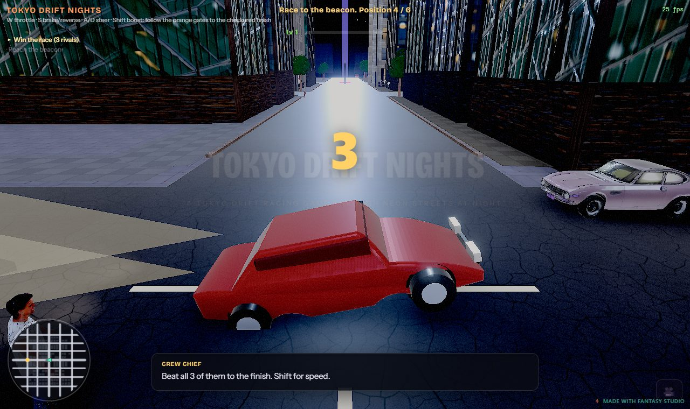
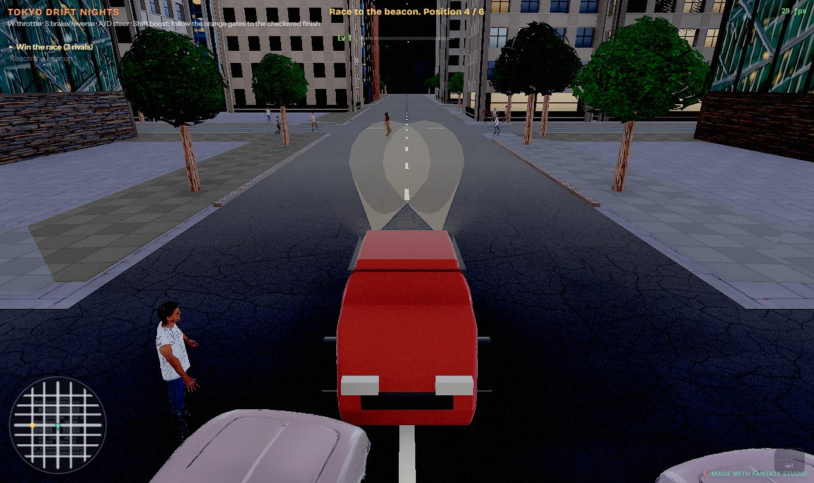
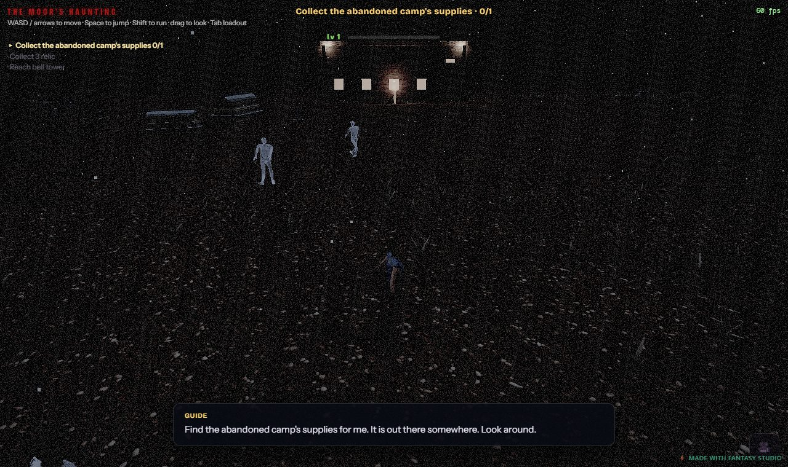
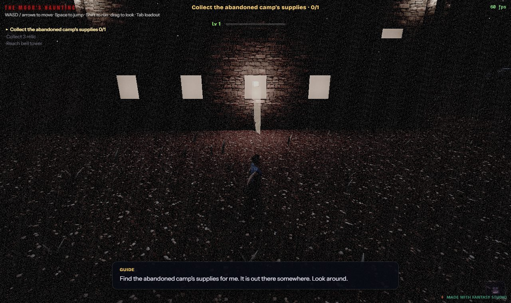

# The adventure fixtures

Shot by `ffixtures.mjs` on every check from the same views, held to the facts below. A change to the adventure side shows here as a picture, not only as a number.

Last shot: 2026-09-21

| fixture | the sentence | facts | pictures |
|---|---|---|---|
| the drift race | a tokyo drift racing game through neon streets at night | city true, mode drive, sky night, race objective true |   |
| the haunted manor | a haunted manor on a windswept moor, find the three relics before the bell tolls | landmark manor, ghosts 3, style horror, sky night |   |
