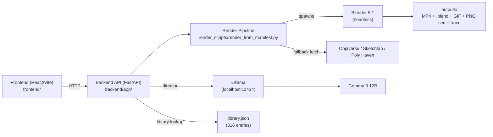
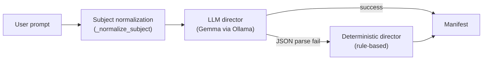
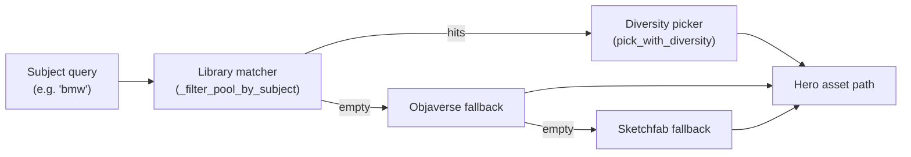
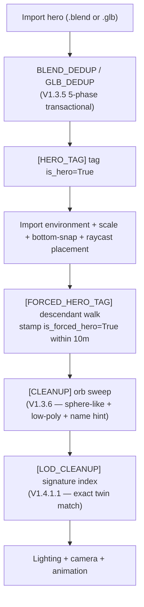

# Architecture

Engineering deep-dive on how Fantasy Studio turns a prompt into a Blender render. Written for contributors and curious engineers — assumes Python and React familiarity.

---

## System overview



Three processes:

1. **Frontend** — React + Vite + Tailwind + base-ui + R3F. Vite dev server on `:3000`, talks to backend via `@tanstack/react-query`
2. **Backend** — FastAPI server on `:8000`. Routes in `app/api/` (`pipeline.py`, `library.py`, `assets.py`, `templates.py`, `exports.py`, `curation.py`, `catalog.py`, `render_extras.py`, `llm_diag.py`)
3. **Blender subprocess** — spawned per render via `app/blender_runner.py`, executes `render_scripts/render_from_manifest.py` against a JSON manifest

The Blender subprocess is the only thing that imports `bpy`. Everything else is pure Python and runs even when Blender isn't installed.

---

## Frontend architecture

`frontend/`:

- **Vite + React 18 + TypeScript** — dev server, type checking via `tsc --noEmit`
- **Routing**: `@tanstack/react-router` (file-based)
- **Server state**: `@tanstack/react-query`
- **Forms**: `react-hook-form` + `zod` schemas + `@hookform/resolvers`
- **3D preview**: `@react-three/fiber` + `@react-three/drei` (planned for V1.5 inline preview)
- **UI primitives**: `@base-ui/react`, `cmdk`, `react-resizable-panels`
- **Styling**: Tailwind 3 + custom CSS variables; lints via `stylelint` and a custom `check-css-variables.js`
- **Animation**: `framer-motion`
- **Toasts**: `react-hot-toast`
- **Carousel**: `embla-carousel-react`
- **Charts** (for the build-in-public dashboard): `recharts`

Component hierarchy roughly: `App → Routes → Studio → { PromptBar, CastPanel, SceneControls, RefinePanel, RenderViewer, OutputDownloads }`.

API client lives in `src/api/` and wraps `fetch` with react-query hooks. Every API call has a typed response shape mirroring the backend's pydantic models.

---

## Backend API

FastAPI app in `app/main.py`, routers in `app/api/`:

| Route prefix | File | Purpose |
|---|---|---|
| `/api/pipeline` | `pipeline.py` | Main render endpoint, status polling, manifest dispatch |
| `/api/library` | `library.py` | `/match` (text query → ranked hits), `/browse` (paginated) |
| `/api/assets` | `assets.py` | Asset details, thumbnail serving, library/browse alt route |
| `/api/templates` | `templates.py` | List recipes + layers |
| `/api/exports` | `exports.py` | Download endpoints for MP4/GIF/PNG/.blend |
| `/api/curation` | `curation.py` | Internal curation tools (provisional review queue) |
| `/api/catalog` | `catalog.py` | Aggregate catalog metadata |
| `/api/render_extras` | `render_extras.py` | Sweep variations, scene refinement |
| `/api/llm_diag` | `llm_diag.py` | LLM health + last-prompt diagnostics |
| `/api/health` | `main.py` | Liveness probe |

All endpoints read `library.json` fresh on each call — no caching layer to invalidate. Library refreshes (V1.4.1) propagate immediately.

---

## The pipeline (deep dive)

The pipeline is one big function in `render_scripts/render_from_manifest.py` (~6700 lines). It's organized as a sequence of named **stages**, each emitting a `[PIPELINE] +N.NNNs STAGE_NAME` marker so the trace log is self-documenting.

### Stage 1 — Prompt parsing + LLM scene planning



- `app/services/asset_agent.py` — entry point
- LLM call uses a structured prompt with required keys (`scene_family`, `subject`, `environment`, `mood`, `energy_level`, `weather`, `camera_suggestion`, `subject_count`)
- Missing keys → fallback. The deterministic director uses keyword maps + the alias system to produce the same manifest schema
- Both paths emit `[PLANNER/LLM]` or `[PLANNER/DETERMINISTIC]` log lines

### Stage 2 — Recipe dispatch

- `app/services/template_v2/dispatcher.py` — weighted scoring
- Iterates `app/templates_v2/recipes/*.json` (15 named recipes + `_default`)
- Scores each recipe against the manifest's scene plan: subject_type match, environment match, dispatch_keywords overlap
- Top scorer drives the render. Logged as `[TEMPLATE_V2_DISPATCH] chose='X' score=N top=[...]`

### Stage 3 — Asset resolution



- `app/services/variant_pool.py` — subject filter + diversity picker (V1.3.7 alias map + scoring)
- `app/services/library_matcher.py` — main library lookup
- `app/services/objaverse_fetcher.py` — fallback hero hero hunt
- `app/services/asset_agent.py` — environment auto-pick via `auto_pick_environment` with min-score gate (V1.3.6 Fix 5)
- `forced_hero_id` / `forced_environment_id` short-circuit auto-pick when the user has manually cast

### Stage 4 — Asset healing (V1.2)

- `app/services/asset_healer.py` — runs once on ingest (not on every render)
- Computes `orientation_fix_rotation_euler`, `ground_offset_z`, `shape_class`, `provisional_ready`
- Persists to `library.json` as metadata; original files never modified
- Applied at import time by `glb_import.py` and `blender_asset_ops.py` via `[HEAL_APPLY]`
- Per-asset `import_rotation_xyz` overrides (V1.3.6 Fix 2) for assets the healer can't auto-correct

### Stage 5 — Scene assembly



- `app/scene/glb_import.py` — `.glb` import + `_dedup_sketchfab_roots`
- `app/scene/blender_asset_ops.py` — `.blend` import + `_dedup_blend_roots` (V1.3.5 5-phase)
- `app/scene/import_normalize.py` — V1.2 healer apply + scale enforcement
- `app/services/camera_director.py` — V1.3.2 single-source-of-truth camera placement
- The `[FORCED_HERO_TAG]` pre-pass and `[CLEANUP]` / `[LOD_CLEANUP]` passes are critical to scene integrity. See [the README's "How it works"](../README.md#how-it-works) for the visible-bug history that motivated them

### Stage 6 — Verification gates

`_hero_verify_gate(manifest)` runs 7 checks before any frame is rendered:

| Check | Lower bound | Upper bound | Failure mode |
|---|---|---|---|
| `has_hero_tag` | ≥ 1 mesh tagged | — | Hard abort |
| `bbox_sane` | 0.2 m diag | 50 m | Hard abort |
| `in_frustum` | hero in camera view | — | Hard abort |
| `fill_ok` | 35% | 70% | Hard abort |
| `not_primitive` | > 100 polys | — | Hard abort |
| `oriented_correctly` | type-aware (vehicles ≠ Z, characters = Z) | — | Hard abort |
| `grounded` | gap < 0.5 m | — | Warn-only |

A `bbox_sane` or `oriented_correctly` failure aborts with `[HERO_VERIFY] ABORT: <reasons>` which `app/blender_runner.py::_format_hero_verify_abort` parses and surfaces as a structured user-facing error.

### Stage 7 — Render execution

- Cycles or Eevee per tier (`app/services/render_tier.py`)
- Engine-aware sample budgets: Eevee 16 / 32 samples, Cycles 128 / 512+
- Frame-by-frame log: `[render] Saved: 'frame_NNNN.png'`
- Optimizer pass (`[OPTIMIZER]`) caps volumetric density and protects `is_hero` objects from culling

### Stage 8 — Post-processing

- Compositor: tier-conditional. Preview tier disables compositor for speed; HQ/Cinematic enable cinematic grade nodes
- Color grade per recipe's `post` layer (`cinematic_graded`, `vintage_film`, `clean_commercial`)
- ffmpeg encode to MP4 (`outputs/blender_render_<ts>.mp4`)

### Stage 9 — Output packaging

- `outputs/blender_render_<ts>/` directory contains:
  - `frame_*.png` (the raw sequence)
  - `pipeline_trace.log` — every stage marker + every category log line
  - `manifest_<ts>.json` (linked from `outputs/manifests/`)
  - `credits.txt` — Sketchfab/Poly Haven attribution per asset used
  - `scene.blend` — the source file, post-render
- The MP4, GIF, and PNG sequence are derived from the frame sequence

---

## Key architectural decisions

### Local-first execution

Everything runs on the user's machine. No API keys, no rate limits, no per-render cost beyond electricity. Cloud render tier is opt-in (V1.5 roadmap) and only handles render execution — director still runs locally.

### Non-destructive asset model

The healer never modifies source files. Corrections are stored as metadata in `library.json`. A user can re-run the healer with a new algorithm and only the metadata updates. The asset cache (`assets/cache/`) is treated as immutable input.

### Renderer-agnostic templates

Recipes and layers are JSON. The executor (`app/services/template_v2/executor.py`) is the only thing that imports `bpy`. V2 backends (Unreal, Godot) replace just the executor — recipes don't change.

### Pipeline trace logging

Every render writes a `pipeline_trace.log` next to the output. Every stage emits `[PIPELINE] +N.NNNs STAGE`. Every meaningful operation emits a `[CATEGORY]` line. **Bugs are diagnosed by grepping**, not by stepping through code.

The `[CATEGORY]` convention is enforced by code review. Every new feature adds new markers.

### Forced-hero tagging

When the user manually casts a hero, `forced_hero_id` is set in the manifest. The asset agent respects it across:

- Curated injector (skipped)
- Prop fetcher (skipped)
- HERO_GATE (validates by id, not by tag match)
- `[FORCED_HERO_TAG]` (stamps `is_forced_hero=True` on descendants)

This prevents asset drift — manual picks survive every downstream override.

### Signature-based dedup (V1.4.1.1)

LOD twins from doubled `Sketchfab_model` parents historically rendered as dual heroes. The fix indexes `is_forced_hero` meshes by `(verts, faces, rounded_dims)` and hides untagged `is_hero` meshes with exact signature match. False-positive rate is structurally zero — the twin must already exist in the forced set.

This generalizes: any future "is X a duplicate of Y?" question can use the same signature primitive.

---

## Extension points

### Adding a new recipe

1. Create `app/templates_v2/recipes/<name>.json`
2. Reference layers from `environments/`, `compositions/`, `lighting/`, `animations/`, `ambient/`, `post/`
3. Set `dispatch_keywords` and `subject_type` so the dispatcher can score it
4. Add example prompts to `docs/PROMPTING.md`

### Adding a new layer

1. Create `app/templates_v2/<layer_type>/<name>.json`
2. The executor walks layer-specific keys (lighting layers set lights; environment layers configure terrain; etc.)
3. Reference the new layer from a recipe

### Adding a new renderer backend

1. Subclass the executor pattern in `app/services/template_v2/executor.py`
2. Implement `apply_layer(layer_type, layer_config)` for each layer type
3. Wire into the dispatcher via a backend-selection flag in the manifest

This is what V2 Unreal Engine integration will look like.

### Adding a new asset source

1. Implement a fetcher in `app/services/<source>_fetcher.py`
2. Return a normalized asset dict (path + subject + tags)
3. Wire into the resolver fallback chain in `app/services/asset_agent.py`

---

## Future architecture

### Multi-subject composition (V2)

The hardest open problem. Approach being prototyped:

1. **Action grammar** in the LLM director: `(subject, verb, object)` triples
2. **Proximity solver** for subject placement: "character holding sword" → arm-tip raycast → sword position
3. **Animation blending** for action verbs: pre-baked verb cycles per character archetype
4. **Multi-armature compatibility** — currently the pipeline assumes one rig at a time

### Unreal Engine backend (V2+)

Same recipe JSON, different executor. Lighting/camera/animation translate to UE's equivalents. Cycles → Lumen + Path Tracer. Asset import via UE's GLB/GLTF support. Estimated: 3-month implementation, gives a 5–10× quality jump on hero shots.

### Cloud render tier (V1.5)

LLM director + scene assembly stay local. The prepared `.blend` file uploads to a render service (Modal / RunPod / similar). Only Cycles tiers offload; Eevee tiers stay local for speed.

---

## File map (key paths)

```
fantasy-studio/                    # the monorepo
├── README.md                      # Public-launch docs
├── INSTALL.md
├── LICENSE                        # BSL 1.1
├── launch.ps1                     # Single-command launcher (Windows)
├── docs/                          # ARCHITECTURE, GALLERY, USER_GUIDE, ...
├── .github/                       # Issue + PR templates, image assets
│
├── backend/                       # Python pipeline (FastAPI + Blender)
│   ├── app/
│   │   ├── api/                       # FastAPI routers (10 files)
│   │   ├── data/library.json          # 316-asset library
│   │   ├── data/library_refresh_report.json
│   │   ├── data/library_triage_report.json
│   │   ├── data/vehicle_lod_audit.json
│   │   ├── scene/
│   │   │   ├── glb_import.py          # .glb importer + dedup
│   │   │   ├── blender_asset_ops.py   # .blend importer + dedup
│   │   │   └── import_normalize.py    # V1.2 healer apply + scale
│   │   ├── services/
│   │   │   ├── asset_agent.py         # LLM director + fallbacks
│   │   │   ├── asset_healer.py        # V1.2 healer
│   │   │   ├── camera_director.py     # V1.3.2 single-source-of-truth camera
│   │   │   ├── library_matcher.py
│   │   │   ├── variant_pool.py        # V1.3.7 alias map + scoring
│   │   │   ├── objaverse_fetcher.py
│   │   │   └── template_v2/
│   │   │       ├── dispatcher.py      # Weighted recipe scoring
│   │   │       └── executor.py        # JSON → bpy ops
│   │   ├── templates_v2/
│   │   │   ├── recipes/               # 15 named recipes + _default
│   │   │   ├── base/                  # Render tier presets
│   │   │   ├── environments/
│   │   │   ├── compositions/
│   │   │   ├── lighting/
│   │   │   ├── animations/
│   │   │   ├── ambient/
│   │   │   └── post/
│   │   ├── blender_runner.py          # Spawns Blender subprocess
│   │   └── main.py                    # FastAPI app
│   ├── render_scripts/
│   │   ├── render_from_manifest.py    # The big one (~6700 lines)
│   │   ├── _thumb_render_subprocess.py
│   │   └── normalize_asset_to_blend.py
│   ├── tools/
│   │   ├── downloads_ingestor.py      # Watches Downloads/ for new assets
│   │   ├── _triage_blender_worker.py
│   │   └── classify_library_assets.py
│   ├── scripts/
│   │   ├── generate_thumbnails.py
│   │   ├── ingest_assets.py
│   │   └── sort_downloads_and_ingest.py
│   └── requirements-hybrid-assets.txt
│
└── frontend/                      # React UI (Vite + base-ui + R3F)
    ├── src/
    │   ├── routes/                    # tanstack-router file-based routes
    │   ├── components/                # base-ui + custom
    │   ├── api/                       # react-query hooks
    │   └── ...
    ├── package.json                   # vite + react + r3f + tanstack
    └── vite.config.ts
```

---

## Performance characteristics

Approximate, on RTX 4070 + 32 GB RAM:

| Stage | Quick Preview | Polished | High Quality | Cinematic |
|---|---|---|---|---|
| LLM director | ~3–7 s | ~3–7 s | ~3–7 s | ~3–7 s |
| Asset resolution | ~0.1 s (cached) — ~30 s (Objaverse fetch) | same | same | same |
| Scene assembly | ~1–3 s | ~1–3 s | ~1–3 s | ~1–3 s |
| Render execution | ~20 s (96 frames) | ~50 s | ~3 m | ~10 m+ |
| Post + encode | ~3 s | ~5 s | ~10 s | ~15 s |

Cold-start render: + 2–5 minutes for Cycles GPU kernel compile.

---

## Where the bodies are buried

Honesty section. Things that need refactoring but are working today:

- **`render_from_manifest.py` is 6700 lines** — the entry-point script does too much. V1.5 refactor target: split into stage-per-file
- **Both `app/api/library.py` and `app/api/assets.py` have a `/library/browse` route** — historical accident, both still work, candidate for consolidation
- **Two curated injection paths exist**, only one was gated by `forced_hero_id` (logged in V1.4.1.1 audit). The redundancy is hidden today by the downstream `[DEDUP]` step, but it's a footgun
- **`tools/downloads_ingestor.py` doesn't recurse nested archives** — Sketchfab archives sometimes ship a `source/<inner>.zip` and we don't unpack it. 3 of 12 test ingests failed for this reason. V1.5 fix
- **No bundled healthcheck script** — `tools/healthcheck.py` referenced in INSTALL.md doesn't exist yet. Manual checks documented as workaround

These are tracked in the [Roadmap](../ROADMAP.md) under Next.

---

## Questions or contribution interest

- **GitHub Discussions** — design questions, "is this a bug?"
- **Discord** — coming soon for launch
- **CONTRIBUTING.md** — how to ship code

If you want to take on the multi-subject V2 work specifically, please open a Discussion before writing code — there's a design sketch we haven't published yet.
